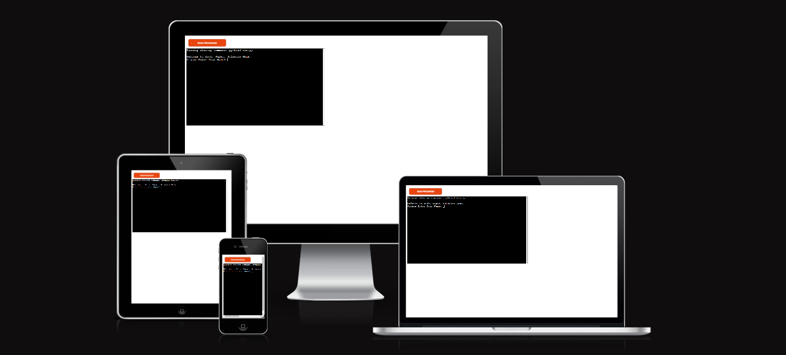
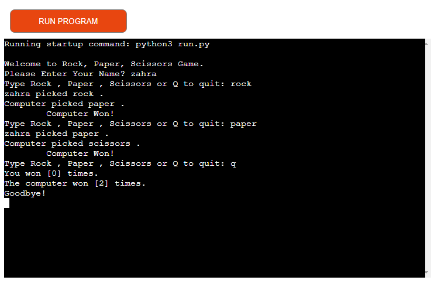
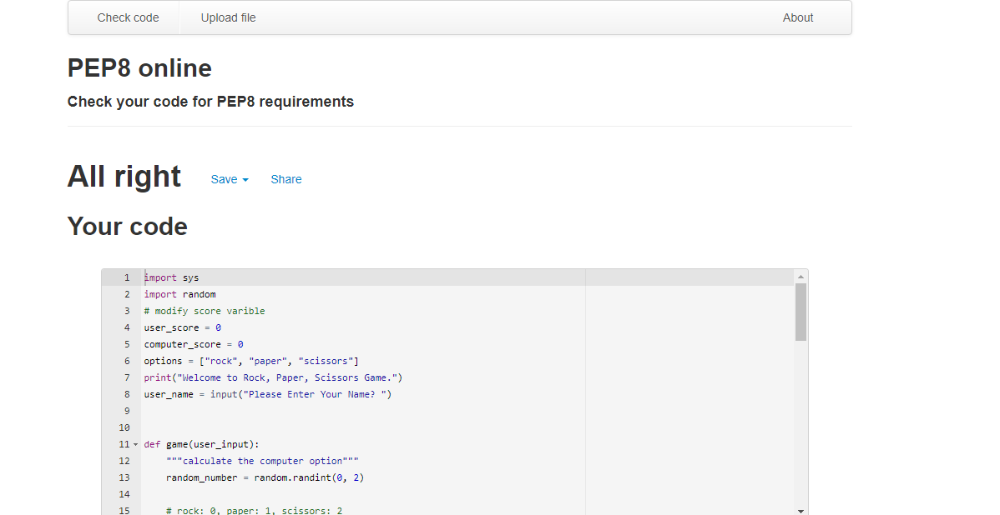

# Rock, Paper, Scissors

Rock, Paper, Scissors is  Command terminal game for Python Users.
This game plays between user and computer, in which each player simultaneously selects one of three options. These options are "rock", "paper", and "scissors". It has three possible outcomes: a draw, a win, or a loss. A player who decides to play rock will beat another player who has chosen scissors ("rock crushes scissors" or "breaks scissors" or sometimes "blunts scissors"), but will lose to one who has played paper ("paper covers rock"); a play of paper will lose to a play of scissors ("scissors cuts paper"). If both players choose the same option, the result will be draw.

Link to deployed website - [Rock, Paper, Scissors_Game](https://rock-paper-scissors-python-gam.herokuapp.com/)

[Go to How to Play](#how-to-play)

[Go to Features](#features)

[Go to Testing](#testing)

[Go to Validator Testing](#validator-testing)

[Go to Deployment](#deployment)

[Go to Credits](#credits)

## How to Play

'Rock, Paper, Scissors' is Command game. On [Wikipedia](https://en.wikipedia.org/wiki/Rock_paper_scissors), you may find out more information.

This game plays between user and computer, in which each player simultaneously selects one of three options. 

These options are "rock", "paper", and "scissors". It has three possible outcomes: a draw, a win, or a loss.

 A player who decides to play rock will beat another player who has chosen scissors ("rock crushes scissors" or "breaks scissors" or sometimes "blunts scissors"), but will lose to one who has played paper ("paper covers rock"); a play of paper will lose to a play of scissors ("scissors cuts paper"). If both players choose the same option, the result will be draw.

## Features

#### __Key Features__

  - Talk the user name first.
  - All inputs are validated and checked for errors.
  - You cannot enter coordinates outside the boundaries of the options.
  - You can just choose one option.
  - Generated randomly

- The Game Options

  - The game options include a clear icons and each button has a title, It's visible for them when user hover with mouse on it.
  - In this section the user can click on buttons and make their choice and plays the game.

  

- The Game Results

  - When the user make a choice, the option relating to their choice is shown on next line.
  - Game randomly selects an option for the computer player and displays the option relating to the computer's choice and then determines who the winner is.
  - The final score will show when user decided to exit the game and write the (Q) character.
  - At the end of game will show the user and computer score.

  
  
  
## Testing

I manually tested this project by carrying out the subsequent actions:

- Verified there are no issues by running the code through a PEP8 linter.

- Given invalid inputs: strings when numbers are anticipated, inputs that are outside of boundaries, and numerous instances of the same guess.

- Tested in my local terminal and the Heroku terminal for the Code Institute.

### __Validator Testing__

Python - no errors found when passing through [PEP8 online](http://pep8online.com)

## Deployment 

This project was deployed using Code Institute's mock terminal for Heroku.

 - Steps for deployment:

   - Run command `heroku login -i`, then input login credentials
   - Run command `heroku create rock-paper-sessores-python-game`
   - In the Heroku app, set buildpacks to `heroku/python` and `heroku/nodejs`
     - Buildpacks must be in this exact order
   - Run command `git push heroku main`

 - Additional Notes:

   - Due to an ongoing issue, the GitHub deployment method for Heroku is currently unavailable

## Credits

 - README structure used from [Sample README.md - Code Institute](https://learn.codeinstitute.net/courses/course-v1:CodeInstitute+PE_PAGPPF+2021_Q2/courseware/b3378fc1159e43e3b70916fdefdfae51/605f34e006594dc4ae19f5e60ec75e2e/)
 - Deployment terminal provided by [Code Institute](https://codeinstitute.net/)
 - Responsive design mockup tool by [Am I Responsive](https://ui.dev/amiresponsive)
 - Battleships game details by [Wikipedia](https://en.wikipedia.org/wiki/Main_Page)
 - Seperate lists code by [User648852 - Stack Overflow](https://stackoverflow.com/questions/13443588/how-can-i-format-a-list-to-print-each-element-on-a-separate-line-in-python)

 [Go back to top](# Rock, Paper, Scissors)

